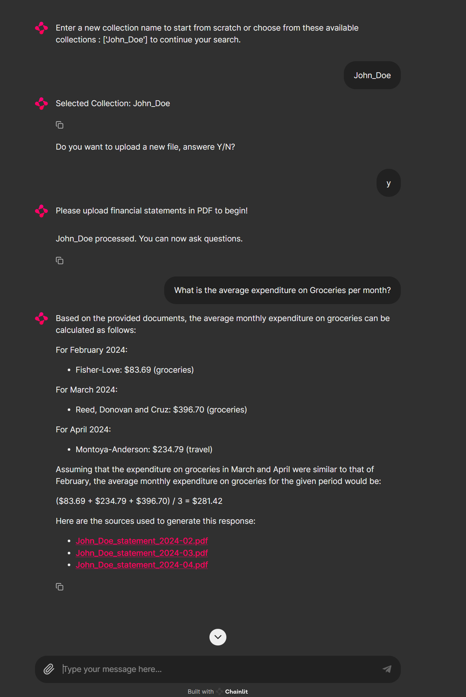

## Personal Financial Advisor

#### Pre-requisites
- Python 3.10+
- Pip
- Virtualenv
- install the dependencies: `pip install -r requirements.txt`
- Request Nvidia LLM API Key from [here](https://build.nvidia.com/nvidia/embed-qa-4?snippet_tab=Python)
- Generate fake statements using `bank_fake_statement_generator.py` & `cc_fake_statement_generator.py`

#### Setup & Run
- Clone this repository
- Navigate to the root directory of this repository
- Create a virtual environment and activate it
- Install dependencies - `python -m pip install -r requirements.txt`
- Complete the pre-rquisites before continuing with next steps
- Create a .env file in the root directory of the project
- Add the following line to the.env file: `NVIDIA_API_KEY=<YOUR_API_KEY>`
- Run the app using the command below: `chainlit run app.py -w`

#### Build & Deploy
- Build the container image using the command below: 
 `docker build -t <YOUR_DOCKERHUB_USERNAME>/personal-financial-advisor:latest`
- Push the image to DockerHub using the command below: 
  `docker push <YOUR_DOCKERHUB_USERNAME>/personal-financial-advisor:latest`
- Run the container using the command below:
  `docker run -p <PORT>:80 --name personal-financial-advisor <YOUR_DOCKERHUB_USERNAME>/personal-financial-advisor:latest`

#### Screenshots
